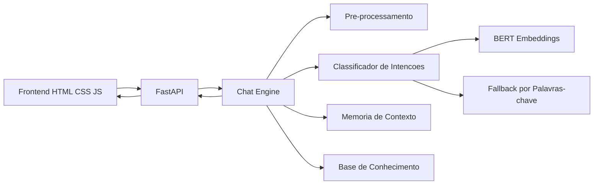
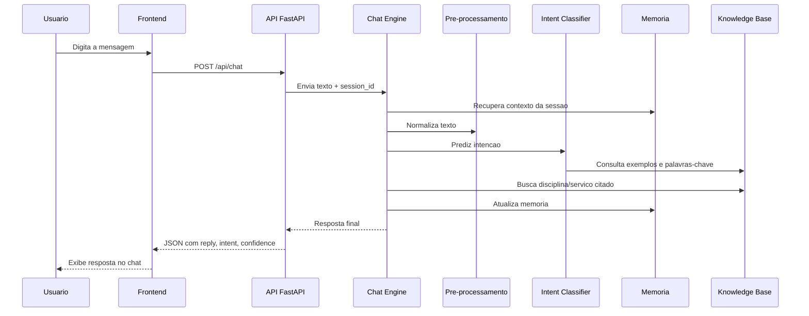
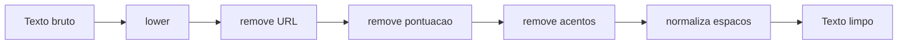
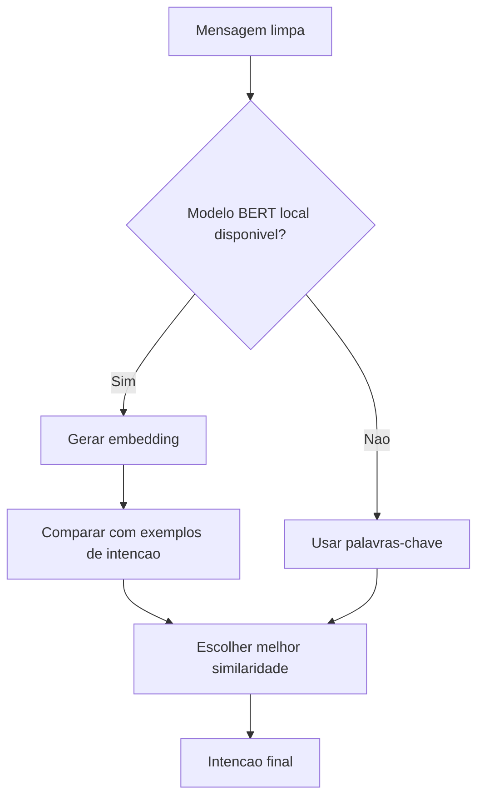
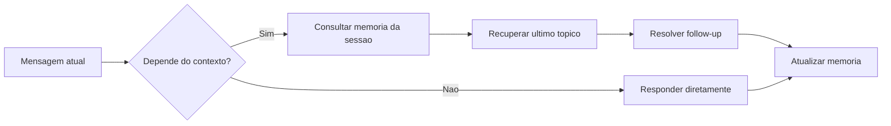
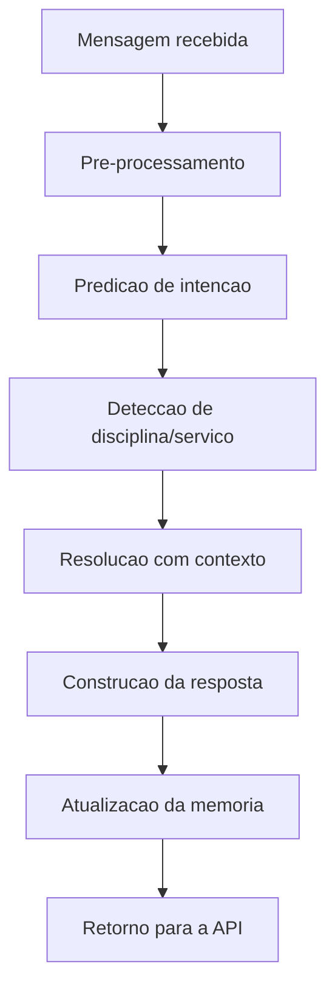
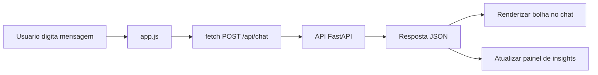

# Assistente Academico Inteligente

Projeto didatico de **Processamento de Linguagem Natural (PLN)** para graduacao, com foco em transformar os conceitos da disciplina em um produto real: um chatbot academico com **FastAPI**, **frontend web**, **memoria de contexto** e **uso de BERT para entendimento de intencoes**.

---

## 1. Visao Geral

Este projeto mostra, de ponta a ponta, como um sistema de PLN pode ser organizado em camadas claras:

1. O usuario escreve uma mensagem no navegador.
2. A interface envia a pergunta para a API.
3. O backend limpa o texto.
4. O motor do chatbot identifica a intencao.
5. O sistema consulta o contexto da conversa.
6. O bot gera uma resposta coerente.
7. A resposta volta para a interface web.

### Objetivos pedagogicos

- Demonstrar **pipeline de pre-processamento**.
- Mostrar **classificacao de intencoes**.
- Introduzir **embeddings com BERT**.
- Explicar **memoria de contexto** em chatbots.
- Ensinar como integrar PLN com uma **API web real**.
- Expor os alunos a uma arquitetura simples, legivel e separada por responsabilidade.

---

## 2. O Que o Chatbot Faz

O bot foi desenhado para responder perguntas comuns da vida universitaria, como:

- **Secretaria**: historico, matricula, orientacoes gerais.
- **Financeiro**: boleto, vencimento, taxas, valores.
- **Disciplinas**: o que se aprende em determinadas materias.
- **Professores**: quem ministra uma disciplina.
- **Small talk**: saudacao, despedida e agradecimento.
- **Follow-up**: perguntas curtas dependentes do contexto, como `E qual o valor?`.

---

## 3. Arquitetura do Projeto

### Diagrama geral da arquitetura



### Camadas

| Camada | Responsabilidade |
|---|---|
| `web/` | Interface de chat no navegador |
| `api/` | Endpoints HTTP e contratos de entrada/saida |
| `nlp/preprocessing.py` | Limpeza e normalizacao do texto |
| `nlp/intent_classifier.py` | Classificacao de intencoes |
| `nlp/bert_encoder.py` | Vetorizacao com BERT |
| `nlp/memory.py` | Memoria de sessao e contexto |
| `nlp/chat_engine.py` | Orquestracao geral do bot |
| `data/knowledge_base.py` | Dados academicos, exemplos e respostas |
| `core/config.py` | Configuracoes do projeto |

---

## 4. Estrutura de Pastas

```text
app/
  api/
    routes.py            # Endpoints da API
    schemas.py           # Modelos de requisicao e resposta
  core/
    config.py            # Configuracoes centrais
  data/
    knowledge_base.py    # Intencoes, servicos, disciplinas e professores
  nlp/
    bert_encoder.py      # Embeddings com BERT
    chat_engine.py       # Motor principal do chatbot
    intent_classifier.py # Classificador de intencoes
    memory.py            # Memoria por sessao
    preprocessing.py     # Limpeza do texto
  web/
    static/
      app.js             # Frontend JavaScript
      styles.css         # Estilos da interface
    templates/
      index.html         # Pagina principal do chat
requirements.txt
README.md
```

---

## 5. Fluxo Completo de uma Mensagem

### Diagrama do ciclo de requisicao



### Explicacao passo a passo

#### 5.1 Entrada do usuario
O aluno digita algo como:

```text
Como solicito meu historico?
```

#### 5.2 Pre-processamento
O texto passa por limpeza em `preprocessing.py`:

- converte para minusculas
- remove URLs
- remove pontuacao
- remove acentos
- normaliza espacos

Exemplo:

```text
Entrada:  "Como solicito meu historico?"
Saida:    "como solicito meu historico"
```

#### 5.3 Classificacao de intencao
O sistema tenta identificar a intencao da mensagem.

Exemplos de intencao:

- `secretaria`
- `financeiro`
- `disciplina_info`
- `professor_info`
- `saudacao`
- `despedida`
- `agradecimento`
- `follow_up`

#### 5.4 Consulta ao contexto
Se a mensagem for vaga, como:

```text
E qual o valor?
```

O sistema verifica o assunto anterior da conversa para inferir o significado.

#### 5.5 Montagem da resposta
O `chat_engine.py` combina:

- texto limpo
- intencao prevista
- entidades detectadas
- memoria da conversa
- base de conhecimento

A partir disso, devolve uma resposta final coerente.

---

## 6. Pre-processamento de Texto

Arquivo principal: `app/nlp/preprocessing.py`

### O que ele faz

- `lower()` para padronizar caixa
- regex para remover URLs
- remocao de pontuacao
- remocao de acentos
- normalizacao de espacos

### Por que isso importa?

Em PLN, textos iguais podem aparecer de formas diferentes:

- `Historico`
- `historico`
- `histórico`
- `historico!!!`

A normalizacao reduz essa variacao e ajuda o classificador.

### Diagrama do pre-processamento



---

## 7. Classificacao de Intencoes

Arquivo principal: `app/nlp/intent_classifier.py`

O classificador usa duas estrategias:

1. **BERT embeddings**
2. **Fallback por palavras-chave**

### Diagrama da decisao



### Como o BERT e usado aqui

O projeto nao faz fine-tuning. Em vez disso, ele usa BERT como **gerador de embeddings**:

- cada frase de exemplo de intencao vira um vetor
- a mensagem do usuario tambem vira um vetor
- o sistema calcula similaridade entre vetores
- a intencao com maior similaridade vence

Essa abordagem e muito boa para ensino porque mostra:

- representacao vetorial
- similaridade semantica
- uso pratico de Transformers

### Fallback por palavras-chave

Se o modelo nao estiver disponivel, o sistema continua funcional com regras simples baseadas em palavras como:

- `historico`
- `boleto`
- `professor`
- `matricula`
- `pln`

Assim, o projeto sempre roda, mesmo em laboratorios sem download liberado.

---

## 8. Memoria e Contexto

Arquivo principal: `app/nlp/memory.py`

A memoria guarda, por sessao:

- `current_topic`
- `last_intent`
- `last_discipline`
- `last_service`
- historico recente da conversa

### Exemplo de dialogo com contexto

```text
Usuario: Como solicito meu historico?
Bot: ... orientacao sobre historico ...
Usuario: E qual o valor?
Bot: ... taxa de emissao do historico ...
```

Sem contexto, a segunda pergunta seria ambigua.

### Diagrama da memoria



---

## 9. Base de Conhecimento

Arquivo principal: `app/data/knowledge_base.py`

A base de conhecimento possui:

- disciplinas
- professores
- topicos de estudo
- servicos academicos
- prazos e valores simulados
- exemplos de intencao
- palavras-chave

### Vantagem didatica

Em vez de depender de banco de dados externo, os dados ficam em Python puro, o que facilita:

- leitura em sala
- mudanca de exemplos
- adaptacao para outros cursos
- criacao de atividades praticas

---

## 10. Motor Principal do Chatbot

Arquivo principal: `app/nlp/chat_engine.py`

O `AcademicChatEngine` e o cerebro da aplicacao. Ele:

1. recebe a mensagem
2. limpa o texto
3. classifica a intencao
4. detecta entidades como disciplina ou servico
5. usa contexto quando necessario
6. gera a resposta final
7. atualiza a memoria

### Diagrama do motor



---

## 11. API FastAPI

Arquivos principais:

- `app/main.py`
- `app/api/routes.py`
- `app/api/schemas.py`

### Endpoints disponiveis

#### `GET /`
Serve a interface web.

#### `GET /api/health`
Retorna o estado da API.

Exemplo:

```json
{
  "status": "ok"
}
```

#### `POST /api/chat`
Recebe a mensagem do usuario e devolve a resposta do bot.

### Exemplo de requisicao

```json
{
  "message": "Quem e o professor de Redes?",
  "session_id": "turma-pln-001"
}
```

### Exemplo de resposta

```json
{
  "session_id": "turma-pln-001",
  "reply": "O professor responsavel por Redes de Computadores e Prof. Renato Silveira.",
  "intent": "professor_info",
  "confidence": 0.42,
  "current_topic": "professores",
  "used_bert": false,
  "ranking": [["professor_info", 0.5]],
  "extracted": {
    "topic": "professores",
    "discipline": "Redes de Computadores"
  }
}
```

### Por que usar FastAPI aqui?

- sintaxe simples
- documentacao automatica
- validacao com Pydantic
- ideal para integrar modelos de IA em APIs reais

---

## 12. Frontend Web

Arquivos principais:

- `app/web/templates/index.html`
- `app/web/static/styles.css`
- `app/web/static/app.js`

### O que o frontend faz

- mostra a janela de chat
- envia mensagens para `/api/chat`
- exibe respostas do bot
- persiste `session_id` no navegador
- mostra informacoes extras, como intencao e confianca

### Diagrama do frontend



---

## 13. Como Executar o Projeto

### 13.1 Criar o ambiente virtual

```powershell
python -m venv .venv
.venv\Scripts\Activate.ps1
```

### 13.2 Instalar dependencias

```powershell
python -m pip install -r requirements.txt
```

### 13.3 Rodar a aplicacao

```powershell
python -m uvicorn app.main:app --reload
```

### 13.4 Abrir no navegador

- Interface: `http://127.0.0.1:8000`
- Docs interativas: `http://127.0.0.1:8000/docs`

---

## 14. Sobre o Uso de BERT

Modelo configurado:

```text
neuralmind/bert-base-portuguese-cased
```

### Comportamento padrao

O projeto tenta usar **somente arquivos locais** do modelo.

Isso evita travamentos em laboratorios sem internet liberada.

### Se quiser permitir download automatico do modelo

```powershell
$env:ALLOW_BERT_DOWNLOAD="1"
python -m uvicorn app.main:app --reload
```

### Resumo da logica

- se o modelo BERT estiver disponivel localmente, ele sera usado
- se nao estiver disponivel, o sistema usa fallback por palavras-chave
- a aplicacao continua funcionando nos dois cenarios

---

## 15. Exemplos de Perguntas para Teste

### Secretaria

- `Como solicito meu historico?`
- `Como funciona a matricula?`
- `Qual o prazo do historico?`

### Financeiro

- `Qual o prazo do boleto?`
- `Meu boleto venceu.`
- `Qual o valor da matricula?`

### Disciplinas

- `O que vou aprender em IA Aplicada?`
- `Me fale sobre PLN.`
- `Qual o conteudo de Redes de Computadores?`

### Professores

- `Quem e o professor de Redes?`
- `Quem ministra IA Aplicada?`
- `Qual professora de PLN?`

### Contexto

- `Como solicito meu historico?`
- `E qual o valor?`
- `E o prazo?`

---

## 16. Ideias de Atividades para os Alunos

### Atividade 1. Adicionar nova intencao
Exemplo: `horario_aulas`.

### Atividade 2. Adicionar nova disciplina
Inserir uma disciplina do curso real da turma.

### Atividade 3. Melhorar o pre-processamento
Adicionar stemming, lematizacao ou correcao ortografica.

### Atividade 4. Comparar abordagens
Comparar:

- palavras-chave
- TF-IDF + Naive Bayes
- embeddings com BERT

### Atividade 5. Avaliar desempenho
Montar um conjunto de perguntas e medir:

- acuracia
- precision
- recall
- erros de contexto

### Atividade 6. Persistir memoria
Salvar sessoes em arquivo JSON ou banco de dados.

---

## 17. Sugestoes de Experimentos em Sala

- Trocar os exemplos de intencao e observar o efeito na classificacao.
- Alterar o limiar de confianca e discutir o impacto.
- Testar frases ambiguas, com girias ou com erros de digitacao.
- Comparar comportamento com e sem contexto.
- Permitir download do modelo e comparar com o fallback.
- Pedir para cada grupo expandir a base para um setor da universidade.

---

## 18. Recursos Uteis no Projeto

### Recursos tecnicos ja implementados

- API REST com FastAPI
- validacao com schemas Pydantic
- frontend simples para demonstracao
- memoria de contexto por sessao
- suporte a BERT local
- fallback robusto sem BERT
- exemplos de intents e entidades academicas
- visualizacao de intencao e confianca na tela
- documentacao automatica em `/docs`

### Recursos didaticos incluidos neste README

- visao arquitetural
- diagramas Mermaid
- fluxo de requisicao
- exemplos de entrada e saida
- ideias de extensao
- atividades de laboratorio
- sugestoes de avaliacao

---

## 19. Possiveis Melhorias Futuras

- Treinar um classificador supervisionado com dados reais da universidade.
- Integrar banco de dados para persistencia.
- Adicionar autenticacao por aluno.
- Conectar com sistema academico real.
- Adicionar RAG com documentos da instituicao.
- Incluir correcao ortografica automatica.
- Implementar avaliacao offline com conjunto de testes.
- Acrescentar painel administrativo.
- Usar um LLM generativo para respostas abertas.

---

## 20. Solucao de Problemas

### A API nao sobe
Verifique se o ambiente virtual esta ativo e se as dependencias foram instaladas.

### O BERT nao e carregado
Isso pode acontecer se o modelo nao estiver disponivel localmente. Nesse caso, o sistema entra em fallback automaticamente.

### O chatbot responde algo muito generico
Adicione mais exemplos em `knowledge_base.py` e aumente a cobertura de palavras-chave.

### O contexto nao funcionou como esperado
Verifique os campos de memoria em `memory.py` e a logica de follow-up em `chat_engine.py`.

---

## 21. Arquivos Mais Importantes para Estudo

Se voce quiser apresentar o projeto em aula, estes sao os arquivos principais para abrir em sequencia:

1. `app/web/templates/index.html`
2. `app/api/routes.py`
3. `app/nlp/preprocessing.py`
4. `app/nlp/intent_classifier.py`
5. `app/nlp/bert_encoder.py`
6. `app/nlp/memory.py`
7. `app/nlp/chat_engine.py`
8. `app/data/knowledge_base.py`

Essa ordem ajuda o aluno a entender o sistema do mais visivel para o mais interno.

---

## 22. Resumo Final

Este projeto e um excelente fechamento para a disciplina porque conecta os principais topicos de PLN em uma aplicacao real:

- limpeza de texto
- representacao vetorial
- classificacao de intencoes
- uso de Transformers
- contexto em dialogo
- API web
- interface interativa

Em outras palavras, o aluno nao ve apenas teoria: ele enxerga como cada etapa participa de um produto funcionando de verdade.
